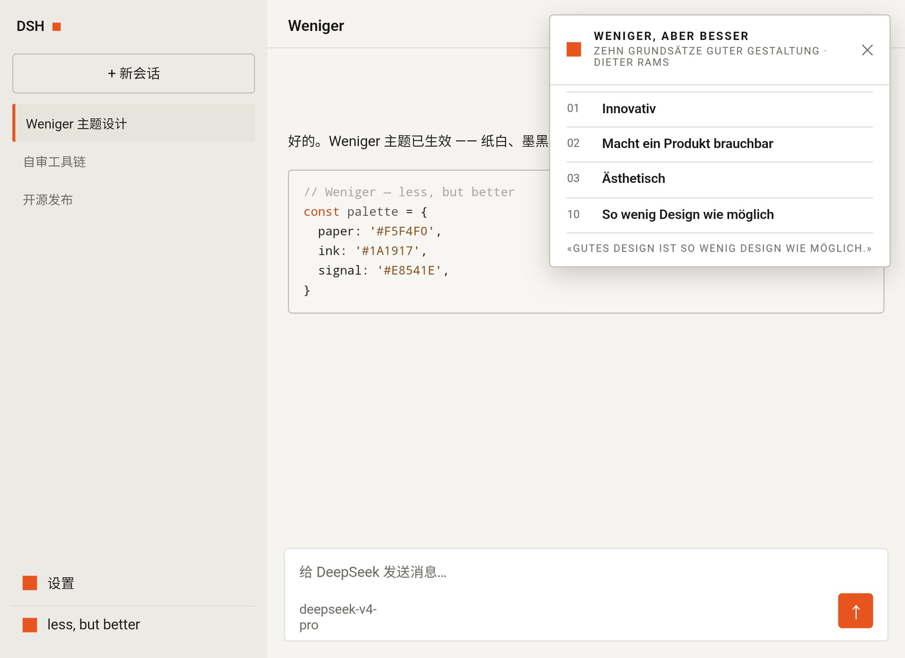

# Weniger

[中文文档](./README.zh.md)

[](https://www.npmjs.com/package/dsh-weniger-theme)
[](LICENSE)

*„Weniger, aber besser" — Less, but better.*

A Dieter Rams-inspired theme for the [DeepSeek Harness](https://github.com/deepseek-ai/deepseek-harness) (DSH) Web GUI: warm paper whites, hairline borders, near-black ink, one signal-orange accent, squared 0–4px geometry, flat surfaces, and a single Swiss type stack across the whole UI.



---

## Installation

Install as a DSH web plugin, then restart `dsh web`:

```sh
dsh plugin --profile web add dsh-weniger-theme@latest
```

Or straight from the GitHub repo:

```sh
dsh plugin --profile web add github:lesliechowsh/dsh-weniger-theme
```

<details>
<summary>Deployments without the <code>dsh plugin</code> subcommand (manual install)</summary>

1. Install the package into your web profile:

   ```sh
   cd "$DSH_HOME/profiles/web"
   npm install dsh-weniger-theme
   ```

2. Append one insert entry to the profile's `cordis.patch.yml`:

   ```yaml
   - insert:
       - id: weniger-theme
         name: 'dsh-weniger-theme'
   ```

3. Restart `dsh web`.

</details>

## Uninstall

```sh
dsh plugin --profile web remove dsh-weniger-theme
```

(Manual installs: remove the `cordis.patch.yml` entry and the dependency, then restart.) The theme switches the UI to the light scheme once on activation; you can switch back to dark in Settings → Appearance afterwards — the Weniger dark palette is complete.

---

## What it does

- Remaps the entire design-token graph (theme-service tokens, derived tokens, and the static color ramp) to a warm Braun-style palette, in both light and dark modes.
- Converges every component radius to a 0–4px grid and flattens all shadows.
- Recolors the user bubble, code blocks, send button, active-nav accents, focus rings, selection, and the syntax-highlight palette.
- Adds a footer chip (orange square + label) that opens a small panel quoting the ten principles of good design, with attribution.

## Repository layout

- `client.js` + `index.js` + `package.json` — the plugin as a standard DSH client module (`dsh.client` manifest).
- `weniger-theme.client.js` — the development form (dynamic plugin) used for iteration; not required for installation.
- `ui-probe.host.js` / `ui-probe.client.js` — self-review tooling used during development.
- `DESIGN-NOTES.md` — design decisions: token layers, palette, radius grid, verification loop.
- `docs/` — screenshots.

## License

MIT — see `LICENSE`.

## Attribution & disclaimer

Inspired by the design philosophy of Dieter Rams and his ten principles of good design, quoted briefly in the UI as homage. This project is **not** affiliated with, endorsed by, or sponsored by Dieter Rams, Vitsœ, Braun GmbH, or Procter & Gamble. "Braun" is a trademark of its respective owner; no Braun trademarks, logos, or product designs are reproduced here. The color palette and layout values are original.
